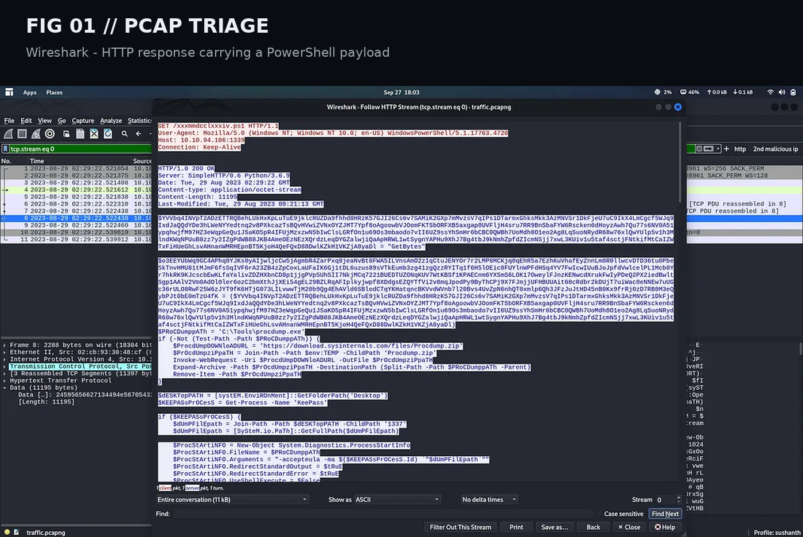
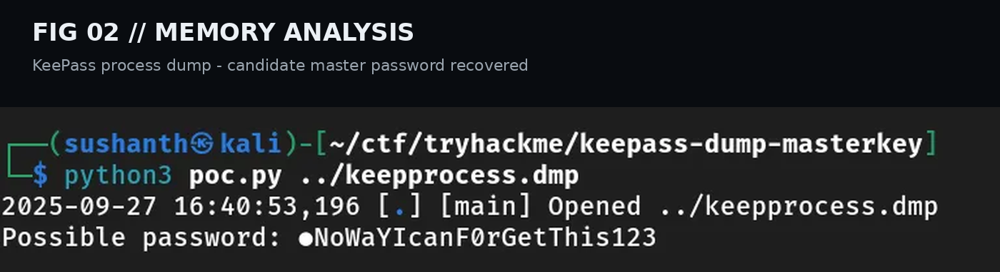
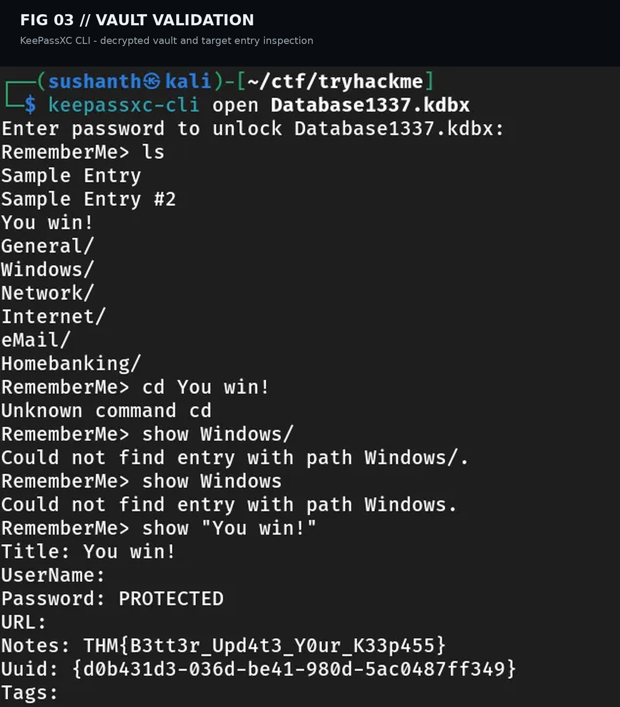

<!-- ========================================================= -->
<!--  EXTRACTED — TRYHACKME WALKTHROUGH (PORTFOLIO EDITION)    -->
<!--  Author: Anurag                                           -->
<!-- ========================================================= -->

<div align="center">

# 🔍 Extracted — TryHackMe Walkthrough


### 🛡️ PCAP Analysis • PowerShell Malware Analysis • TCP Stream Reconstruction • KeePass Memory Forensics

*A professional forensic walkthrough documenting the complete investigation process from packet capture analysis to encrypted KeePass vault recovery inside a controlled TryHackMe lab.*

---

### 👨‍💻 Author

**Anurag** — Cybersecurity Enthusiast | SOC Analyst | Digital Forensics Learner

[](https://github.com/anurag-rvnkr1)

---

</div>

## 📖 Overview

**Extracted** is a **Digital Forensics + Network Analysis** room on **TryHackMe** where the investigation starts from a **network packet capture** instead of an exposed service or vulnerable web application.

The objective is to reconstruct an attacker’s activity by analyzing captured network traffic, reverse engineering a malicious PowerShell payload, recovering exfiltrated artifacts, extracting credentials from process memory, and validating an encrypted password vault.

Rather than exploiting a target directly, this challenge focuses on understanding **how evidence connects across multiple forensic artifacts**.

> This repository documents the complete methodology while intentionally **redacting the original TryHackMe flag and recovered master password** to preserve challenge integrity.

---

# 🎯 Room Objectives

- Analyze a PCAP using Wireshark.
- Identify malicious PowerShell traffic.
- Reverse attacker obfuscation techniques.
- Recover exfiltrated files from TCP streams.
- Decode Base64 payloads.
- Reverse XOR encryption.
- Analyze Windows process memory.
- Recover a KeePass master password candidate.
- Open an encrypted KeePass database.
- Validate recovered credentials without exposing secrets.

---

# 🧠 Skills Demonstrated

<table>
<tr>
<td width="50%">

### Network Forensics

- HTTP Packet Inspection
- TCP Stream Reconstruction
- Packet Filtering
- Raw Payload Extraction
- Traffic Correlation

</td>
<td width="50%">

### Memory & Credential Analysis

- KeePass Process Dump Analysis
- UTF-16LE String Recovery
- Password Candidate Validation
- KeePass Database Investigation
- Credential Recovery Workflow

</td>
</tr>
<tr>
<td>

### Malware Analysis

- PowerShell Payload Analysis
- Base64 Decoding
- XOR Obfuscation Reversal
- Artifact Reconstruction

</td>
<td>

### Defensive Investigation

- Evidence Correlation
- Incident Response Methodology
- Artifact Validation
- Detection Opportunities

</td>
</tr>
</table>

---

# ⚡ Attack Chain / Investigation Workflow

```text
                Network Packet Capture (.pcapng)
                           │
                           ▼
                HTTP PowerShell Payload Delivery
                           │
                           ▼
             Analyze PowerShell Script Behaviour
                           │
        ┌──────────────────┴──────────────────┐
        ▼                                     ▼
TCP Port 1337                         TCP Port 1338
KeePass Process Dump                  KeePass Database
        │                                     │
        ▼                                     ▼
 Base64 Decode                         Base64 Decode
        │                                     │
        ▼                                     ▼
   XOR (0x41)                           XOR (0x42)
        │                                     │
        ▼                                     ▼
 keepprocess.dmp                     Database1337.kdbx
        │                                     │
        └───────────────┬─────────────────────┘
                        ▼
            KeePass Memory Analysis
                        ▼
        Candidate Master Password Recovery
                        ▼
          KeePass Vault Authentication
                        ▼
         Sensitive Entry Validation (Redacted)
```

---

# 🧰 Tools Used

| Tool | Purpose |
|------|---------|
| **Wireshark** | PCAP investigation and HTTP/TCP analysis |
| **TShark** | CLI TCP stream extraction |
| **Python 3** | Base64 decoding and XOR recovery |
| **xxd** | Convert hexadecimal streams into binary |
| **KeepassXC CLI** | Inspect encrypted KeePass vault |
| **John the Ripper** | Validate candidate passwords |
| **KeePass Memory Parser** | Recover master password candidates |

---

# 🗂️ Repository Structure

```text
Extracted-TryHackMe-Walkthrough/
│
├── README.md
├── SECURITY.md
├── LICENSE
│
├── Documentation/
│   ├── Documentation.md
│   └── Extracted_TryHackMe_Documentation.docx
│
├── Resources/
│   └── notes.md
│
├── Screenshots/
│   ├── 01_wireshark_powershell_delivery.png
│   ├── 02_keepass_dump_extraction.png
│   ├── 03_keepass_vault_recovery.png
│   └── 04_attack_chain.png (optional generated)
│
├── docs/
│   ├── index.md
│   ├── _config.yml
│   └── assets/
│       ├── img/
│       └── css/
│           └── custom.scss
│
└── .github/
    └── workflows/
        └── pages.yml
```

Designed for **GitHub Pages Portfolio Deployment**.

---

# 🧪 Investigation Walkthrough

## Phase 1 — Initial PCAP Triage

The investigation begins with a packet capture containing outbound HTTP traffic.

### Goals

- Identify suspicious HTTP requests.
- Locate executable payloads.
- Identify attacker infrastructure.
- Pivot into PowerShell activity.

### Evidence Collected

- HTTP GET request for a `.ps1` file.
- Windows PowerShell User-Agent.
- Suspicious response body containing encoded PowerShell.

<p align="center">

</p>

**Figure 01 — PowerShell payload delivered over HTTP.**

---

## Phase 2 — PowerShell Payload Analysis

Static analysis reveals the payload's objectives.

### Key Behaviour

- Searches for KeePass process.
- Creates Windows process dump.
- Reads KeePass database.
- XOR encrypts artifacts.
- Base64 encodes output.
- Exfiltrates files over TCP.

### Exfiltration Channels

| TCP Port | Artifact |
|----------|----------|
| **1337** | KeePass Process Dump |
| **1338** | KeePass Database |
| **1339** | PowerShell Delivery |

---

## Phase 3 — TCP Stream Reconstruction

The attacker transmitted binary artifacts as Base64 over TCP streams.

### Workflow

1. Follow TCP Stream.
2. Export **Raw** payload.
3. Save stream.
4. Convert hexadecimal payload into binary.

```bash
tshark -r traffic.pcapng \
-Y "tcp.port == 1338" \
-T fields -e tcp.payload \
| tr -d '\n' > combined_hex_1338.txt

xxd -r -p combined_hex_1338.txt > stream_1338.raw
```

Repeat for TCP port **1337**.

---

## Phase 4 — Artifact Recovery

The captured streams are reconstructed by reversing attacker encoding.

### Recovery Process

```text
Captured TCP Stream
        │
        ▼
ASCII Base64
        │
        ▼
Base64 Decode
        │
        ▼
Single Byte XOR
        │
        ▼
Original Binary Artifact
```

### Output Artifacts

| Artifact | Description |
|----------|-------------|
| `Database1337.kdbx` | KeePass encrypted vault |
| `keepprocess.dmp` | Windows process memory dump |

---

## Phase 5 — KeePass Memory Analysis

The recovered process dump is analyzed to identify credential material.

### Investigation Focus

- UTF-16LE strings.
- KeePass structures.
- Candidate passwords.
- Memory-resident secrets.

<p align="center">

</p>

**Figure 02 — Candidate master password extracted from KeePass process memory.**

---

## Phase 6 — Candidate Password Validation

Recovered password contains an unresolved placeholder character.

Instead of trusting incomplete output, candidates are generated and validated.

### Validation Pipeline

- Generate candidate wordlist.
- Convert `.kdbx` into John format.
- Validate candidates.
- Identify successful password.

```bash
keepass2john Database1337.kdbx > db.hash

john --wordlist=candidates.txt db.hash

john --show db.hash
```

---

## Phase 7 — KeePass Vault Validation

Successful authentication allows inspection of the recovered vault.

<p align="center">

</p>

**Figure 03 — KeePassXC CLI successfully authenticates into the recovered vault.**

Sensitive values remain **redacted**.

---

# 🔐 KeePass Forensics Explained

## Why Recover Both Files?

| Artifact | Security Impact |
|----------|-----------------|
| `.kdbx` | Encrypted password vault stored on disk |
| `.dmp` | Runtime memory containing credential material |

### Why Memory Matters

KeePass protects passwords **at rest**, but when unlocked it temporarily stores decrypted information in memory.

Memory analysis can expose:

- Master password.
- Session keys.
- Cached strings.
- Clipboard remnants.
- Temporary decrypted secrets.

This room demonstrates a realistic credential theft scenario seen during incident response investigations.

---

# 📊 Evidence Timeline

| Stage | Evidence |
|--------|----------|
| PCAP Inspection | HTTP request identified |
| Payload Analysis | PowerShell reverse engineered |
| TCP Streams | Raw artifacts extracted |
| Base64 Recovery | Binary restored |
| XOR Reversal | Original files reconstructed |
| Memory Analysis | Password candidate recovered |
| Vault Validation | KeePass database accessed |
| Target Entry | Successfully validated (redacted) |

---

# 🛡️ Defensive Takeaways

This challenge highlights several defensive monitoring opportunities.

### Detection Opportunities

- PowerShell downloading remote scripts.
- Unexpected outbound TCP connections.
- Base64 encoded network payloads.
- Creation of Windows process dumps.
- KeePass process memory access.
- Encoded exfiltration over uncommon ports.

### Blue Team Lessons

- Restrict PowerShell execution policies.
- Monitor suspicious process dump creation.
- Alert on encoded outbound traffic.
- Protect password managers from unauthorized memory access.
- Correlate endpoint telemetry with network evidence.

---

# 📚 MITRE ATT&CK Mapping

| Technique | ATT&CK |
|-----------|---------|
| PowerShell Execution | T1059.001 |
| Command & Scripting Interpreter | T1059 |
| Data Obfuscation (XOR/Base64) | T1027 |
| Exfiltration Over C2 Channel | T1041 |
| Process Memory Dump | T1003 |
| Credential Access | TA0006 |

---

# 📁 Documentation Included

| File | Description |
|------|-------------|
| `README.md` | Portfolio overview |
| `Documentation/Documentation.md` | Complete forensic walkthrough |
| `Documentation.docx` | Printable investigation report |
| `Resources/notes.md` | Commands and analyst cheat sheet |
| `docs/index.md` | Premium GitHub Pages portfolio |
| `SECURITY.md` | Responsible disclosure policy |

---

# 🚀 GitHub Pages Portfolio

This repository includes a fully customized **GitHub Pages documentation site** built using **Jekyll Theme Primer**.

### Features

- Responsive landing page.
- Dark hacker-inspired styling.
- Investigation timeline.
- Evidence gallery.
- MITRE mapping.
- Tool references.
- Defensive recommendations.
- Portfolio-safe redactions.

---

# 📌 Learning Outcomes

After completing this room, I gained practical experience with:

- Network traffic investigation.
- Packet reconstruction.
- PowerShell malware analysis.
- Artifact decoding.
- Windows memory forensics.
- KeePass credential recovery methodology.
- Digital evidence validation.
- Incident-response documentation.

---

# ⚠️ Ethical Use Notice

This repository is published **solely for educational purposes**.

All techniques demonstrated were performed inside an **authorized TryHackMe laboratory environment**.

The repository intentionally **does not disclose**:

- Original TryHackMe flag.
- Exact recovered KeePass master password.
- Vault UUID.
- Sensitive challenge secrets.

---

<div align="center">

## ⭐ If this repository helped you learn Digital Forensics or Network Analysis, consider starring the project.

### Built for Cybersecurity Portfolio • TryHackMe • Digital Forensics • SOC Learning

**Made with ❤️ by Anurag**

</div>
